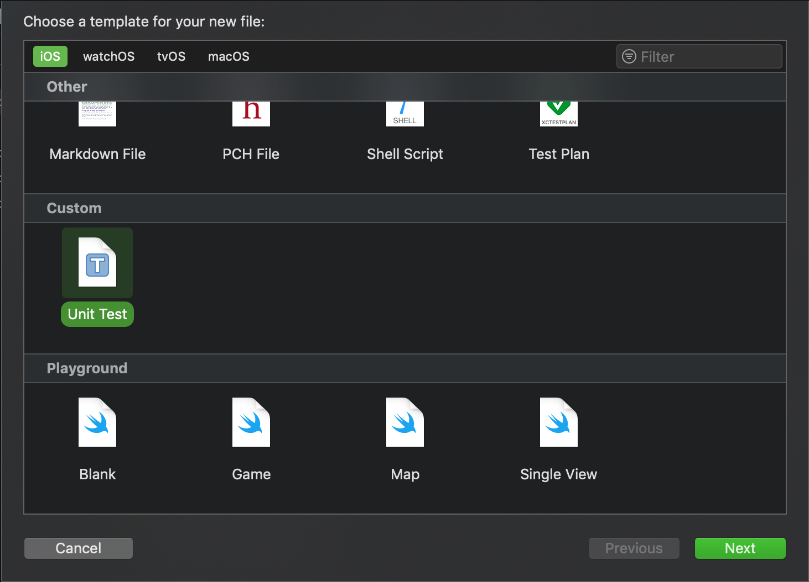

# Xcode Templates

## How to make it work

1. Go to `~/Library/Developer/Xcode/` and create a folder named `Templates`.
2. If you want the custom templates to be separated from the original ones with a specific name (like in the image above), you should create another folder inside `Templates` with that name (e.g. `Custom`). Otherwise, the separator will be called `Templates`.
3. Put the *.xctemplate files from this repository in the folder you created.
